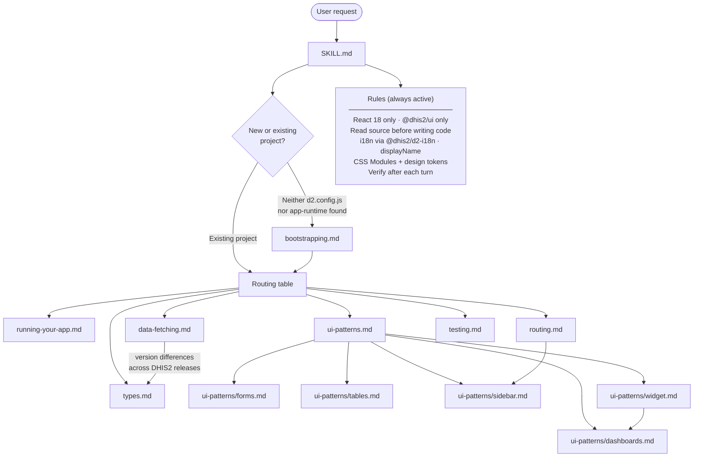

# ai-devtools

AI development tools for the DHIS2 ecosystem — published as standalone npm packages from this monorepo.

For guidance on using AI agents to build DHIS2 applications, see the [AI-assisted App Development guide](https://developers.dhis2.org/docs/guides/ai-development) on the DHIS2 Developer Portal.

## Install skills

> **Attribution** — `@dhis2/skill-dhis2-apps` is based on [dhis2-app-skills](https://github.com/devotta-labs/dhis2-app-skills) by [Eirik Haugstulen](https://github.com/eirikur-haugstulen) at [Devotta Labs](https://github.com/devotta-labs).

```sh
# All skills (interactive prompt to select)
npx skills add dhis2/ai-devtools

# A specific skill by name
npx skills add dhis2/ai-devtools --skill dhis2-apps

# A specific skill by path
npx skills add https://github.com/dhis2/ai-devtools/tree/main/src/skills/dhis2-apps
```

## `@dhis2/skill-dhis2-apps`

An AI skill for building production-quality custom DHIS2 web applications. It guides an AI agent through the full development lifecycle — scaffolding, data fetching, UI, testing, and App Hub compliance — using the DHIS2 App Platform, `@dhis2/ui`, and the DHIS2 Web API.

The skill reads `@dhis2/api-types` OpenAPI specs and platform library source directly from `node_modules` before writing any code, so it never guesses at API shapes or component props. It cross-checks endpoints across bundled version specs (v40–v43) and surfaces differences to the developer before implementation.

### How it works



### Install

```sh
npx skills add dhis2/ai-devtools --skill dhis2-apps
```

## `@dhis2/skill-modernise-apps`

An AI skill for bringing an existing DHIS2 app's tooling up to date. It covers two
independent migrations — an app can need either, both, or neither:

- **Yarn → pnpm.** Bumps `@dhis2/cli-app-scripts` to a pnpm-capable version, adds a
  `pnpm-workspace.yaml` with the hoist patterns `@dhis2/app-shell` needs, converts the
  lockfile, fixes the phantom-dependency imports that Yarn 1's flat hoisting used to paper
  over, and updates git hooks and CI to call `pnpm` instead of `yarn`.
- **`@dhis2/cli-style` → shared configs.** Replaces the `d2-style` CLI with
  `@dhis2/config-eslint`/`@dhis2/config-prettier`, a flat `eslint.config.mjs` and
  `.prettierrc.mjs`, and migrates git hooks from the old `.hooks/` + `d2-style` setup to
  native `husky`/`lint-staged` (with `commitlint` standing in for any commit-message check
  that used to go through `d2-style`) — the same setup a freshly scaffolded app already uses
  by default.

Either migration ends with an install/build/lint pass to catch anything the change broke,
plus an optional sanity check that starts the app against a real DHIS2 server and confirms
the UI still renders after logging in.

### Install

```sh
npx skills add dhis2/ai-devtools --skill modernise-apps
```

---

## Contributing

```sh
pnpm install        # install dependencies
pnpm lint           # check formatting
pnpm changeset      # record a changeset before opening a PR
```

See [CLAUDE.md](./CLAUDE.md) for repo structure and release flow details.

### Testing a skill locally, on another project

`npx skills add` accepts a local filesystem path, not just a GitHub org — no need to push
your changes anywhere first:

```sh
cd /path/to/some-other-project
npx skills add /path/to/ai-devtools --skill modernise-apps -y
```

This copies the skill into that project's `.agents/skills/<name>/` (with a `.claude/skills/`
symlink for Claude Code to discover it) and records the source path in `skills-lock.json`.
It's a one-time snapshot, not a live link — re-run the same command (or `npx skills update`)
after editing the skill to pick up changes. Add `-g`/`--global` instead to install it for
every local project under this machine's Claude Code profile, rather than just one.

Once installed, open a Claude Code session in that project and either describe a matching
task naturally (the skill's description should trigger it) or invoke it explicitly with
`/<skill-name>`.

For fast iteration while actively editing a skill, skip installing entirely and just point a
session at the file directly — always reflects your latest edits, but doesn't exercise
auto-triggering: _"Read and follow `/path/to/ai-devtools/src/skills/<name>/SKILL.md` to do
the task."_
