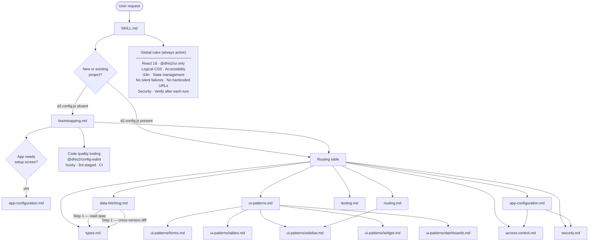

# ai-devtools

AI development tools for the DHIS2 ecosystem — published as standalone npm packages from this monorepo.

For guidance on using AI agents to build DHIS2 applications, see the [AI-assisted App Development guide](https://developers.dhis2.org/docs/guides/ai-development) on the DHIS2 Developer Portal.

## Install skills

> **Attribution** — `@dhis2/skill-dhis2-apps` is based on [dhis2-app-skills](https://github.com/devotta-labs/dhis2-app-skills) by [Eirik Haugstulen](https://github.com/eirikur-haugstulen) at [Devotta Labs](https://github.com/devotta-labs).

```sh
# All skills (interactive prompt to select)
npx skills add dhis2/ai-devtools

# A specific skill by name
npx skills add dhis2/ai-devtools --skill dhis2-apps

# A specific skill by path
npx skills add https://github.com/dhis2/ai-devtools/tree/main/src/skills/dhis2-apps
```

## `@dhis2/skill-dhis2-apps`

An AI skill for building production-quality custom DHIS2 web applications. It guides an AI agent through the full development lifecycle — scaffolding, data fetching, UI, testing, and App Hub compliance — using the DHIS2 App Platform, `@dhis2/ui`, and the DHIS2 Web API.

The skill reads `@dhis2/api-types` OpenAPI specs and platform library source directly from `node_modules` before writing any code, so it never guesses at API shapes or component props. It cross-checks endpoints across bundled version specs (v40–v43) and surfaces differences to the developer before implementation.

### How it works



### Install

```sh
npx skills add dhis2/ai-devtools --skill dhis2-apps
```

---

## Contributing

```sh
pnpm install        # install dependencies
pnpm lint           # check formatting
pnpm changeset      # record a changeset before opening a PR
```

See [CLAUDE.md](./CLAUDE.md) for repo structure and release flow details.
