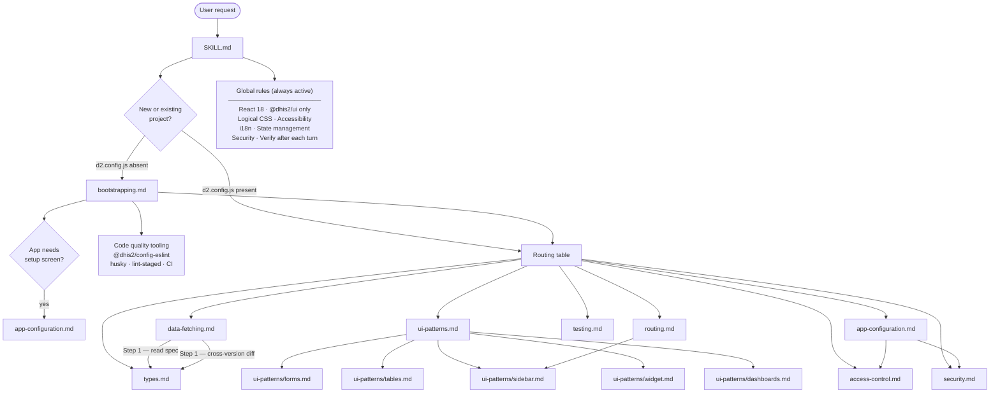

# Skill Flow

```mermaid
flowchart TD
    U([User request]) --> S[SKILL.md]

    S --> Q{New or existing\nproject?}

    Q -->|d2.config.js absent| BOOT[bootstrapping.md]
    Q -->|d2.config.js present| RT[Routing table]

    BOOT --> BOOT2[Code quality tooling\n@dhis2/config-eslint\nhusky · lint-staged · CI]
    BOOT --> BOOT3{App needs\nsetup screen?}
    BOOT3 -->|yes| AC2[app-configuration.md]
    BOOT --> RT

    RT --> DF[data-fetching.md]
    RT --> UI[ui-patterns.md]
    RT --> RO[routing.md]
    RT --> TY[types.md]
    RT --> TE[testing.md]
    RT --> AC[access-control.md]
    RT --> SE[security.md]
    RT --> AP[app-configuration.md]

    DF -->|Step 1 — read spec| TY
    DF -->|Step 1 — cross-version diff| TY

    UI --> UIF[ui-patterns/forms.md]
    UI --> UIT[ui-patterns/tables.md]
    UI --> UIS[ui-patterns/sidebar.md]
    UI --> UIW[ui-patterns/widget.md]
    UI --> UID[ui-patterns/dashboards.md]

    RO --> UIS

    AP --> SE
    AP --> AC

    S --> RULES["Global rules (always active)\n─────────────────────\nReact 18 · @dhis2/ui only\nLogical CSS · Accessibility\ni18n · State management\nSecurity · Verify after each turn"]
```
